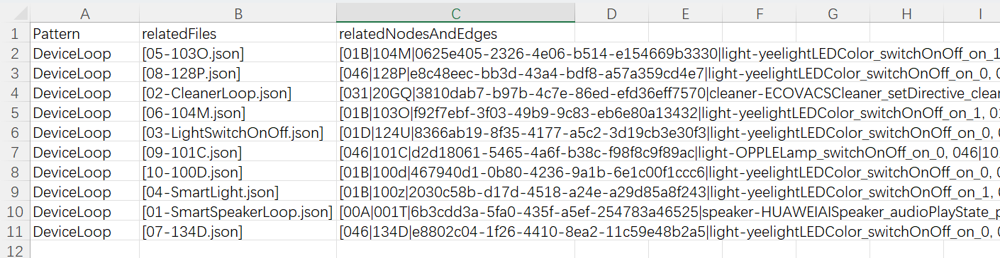

# KnowDetector
This repository is dedicated to sharing the tool KnowDetector and the
data for the ASE 2023 paper entitled 'Detecting Smart Home Automation
Application Interferences with Domain Knowledge'.

## Introduction
The KnowDetector parses a set of automation applications (group data),
extracting their conditions, events, and actions. It forms a basic
Event-Condition-Action (ECA) network based on the control
relationships. Then, using a knowledge graph, it enriches the semantic
information to form an automated semantic network. Finally, pattern
matching is performed based on the proposed sub-graph patterns of
interference, in conjunction with semantic information, to detect
interference.

## Getting started
### Environment requirements
- Java 1.8

The dependencies can be found in pom.xml


### How to run

- Quick run

1. We provide a JAR package (knowdetector_jar/knowdetector.jar) that
   can be executed using the following instructions.
2. Prior to executing the code, please make sure that you have placed
   the grouped test files into the **knowdetector_jar/testFiles**
   folder. We have already provided some group data (test data) in the
   **knowdetector_jar/testFiles** directory. 
3. ```java -jar knowdetector.jar --testFilePath --resultFilePath```
   
   For example: ```java -jar knowdetector.jar ./testFiles/10Loops ./result```
4. The results will be stored in **knowdetector_jar/result**

The results of the aforementioned instructions are as follows:


The results are saved in three columns, indicating the corresponding
interference pattern, the involved files, and the related edges and
vertices.


- Build from source code

1. Configure the programs using your IDE, such as IntelliJ IDEA.
2. Prior to executing the code, please make sure that you have placed
   the grouped test files into the **src/main/resources/testFiles**
   folder. We have already provided some group data (test data) in the
   **src/main/resources/testFiles** directory.
3. Run the file **src/main/java/Detection.java** to detect automation
   interferences.
4. The results will be stored in the file
   **src/main/resource/results/result.csv**


## Knowledge graph data
The knowledge graph data is located in the /data directory. For the
sake of simplicity, we have presented the knowledge graph data using
.csv files. Specifically:

- DeviceModel.csv captures the device models.

- relation.csv captures the relations between device services.

### Detailed description

The **DeviceModel.csv** contains 17 columns.

- **Id**. Unique ID used for counting
- **device**. Device category, such as AC (Air Conditioner), light.
- **deviceName**. Specific device names, such as OPPLELamp and
  yeelightLEDColor.
- **devType**. Device types extracted from device metadata.
- **prodId**. Product Ids extracted from device metadata.
- **capabilityId**. Unique ID of device capabilities.
- **capabilityDescription**. The capability description.
- **commandId**. Unique ID of commands.
- **valueType**. Parameter types of commands, including "enumeration"
  types and "range" types.
- **enum_values**. Detailed enum. data.
- **value**. The specific value of the enum data.
- **max, min**. The range value.
- **serviceId**. Unique ID for device service, it is composed of
  device-deviceName_capabilityId_commandId_value.
- **serviceDescription**. The service description.
- **influencedChannels**. Physical channels affected by the device
  service.
- **influenceType**. Types of impact, including "hasDecreased" and
  "hasIncreased".

The **relation.csv** contains 4 columns.

- **Id**. Unique ID used for counting
- **sourceService**. Source service.
- **targetService**. Target service.
- **relation**. Relationships between device services, including
  "implied" and "exclusive".


## Publicly shared data
We provide two set of data, i.e., IFTTT data and the commercial data,
in directories **data/IFTTT** and **data/commercial data**,
respectively.
### IFTTT data
The raw data is listed in **IFTTT_raw_data.json**. We have transformed
the data into a JSON format that is easy to parse, based on the
provided knowledge model. You can find the file in the **IFTTT_data**
folder.

### Commercial data
We converted and anonymized a portion of commercial automation data in
the form of annotated JSON files. Commercial data is located in the
**data/commercial data** directory, which includes all the data (under
the **all_data** directory) as well as the grouped data (under the
**group_data** directory, each group is a set of automations). The
**group_data** can be used as a benchmark for testing. The JSON file
is as follows:

'''

    {"id": "a753cd54-f010-4328-8c69-22a0d38bd1a1",
    "trigger": {
        "conditions": [
            {
                "condId": "cond.temperature",
                "physical": "temperature",
                "params": {
                    "operator": ">",
                    "value": {
                        "range":"30"
                    }
                }
            }
        ],
        "events": [
            {
                "devType": "00A",
                "deviceId": "6b3cdd3a-5fa0-435f-a5ef-254783a46525",
                "eventId": "eff4cefc-9dc8-46c0-8e55-7bec9c0c82fe",
                "params": {
                    "capabilityId": "audioPlayState",
                    "command": "pause",
                    "value": "1"
                },
                "prodId": "001T"
            }
        ]
    },
    "actions": [
        {
            "actions": [
                {
                    "actionId": "469fbd2d-ad13-4cae-9486-c8b5a5e7056a",
                    "devType": "00A",
                    "deviceId": "6b3cdd3a-5fa0-435f-a5ef-254783a46525",
                    "params": {
                        "capabilityId": "playMusic",
                        "command": "play",
                        "value": "aiting:5373510"
                    },
                    "prodId": "001T"
                },
                {
                    "actionId": "fbf0e4aa-dd96-4930-ac04-29100ceb3c98",
                    "devType": "00A",
                    "deviceId": "6b3cdd3a-5fa0-435f-a5ef-254783a46525",
                    "params": {
                        "capabilityId": "audioPlayState",
                        "command": "pause",
                        "value": "1"
                    },
                    "prodId": "001T"
                }
            ],
            "delay": {
                "delaySync": false
            }
        }
    ]}

'''

## Publication
If you are interested in our work, you can find more details in our paper listed below. If you use our dateset and tool, please cite our paper.

Detecting Smart Home Automation Application Interferences with Domain Knowledge

38th International Conference on Automated Software Engineering (ASE'23)